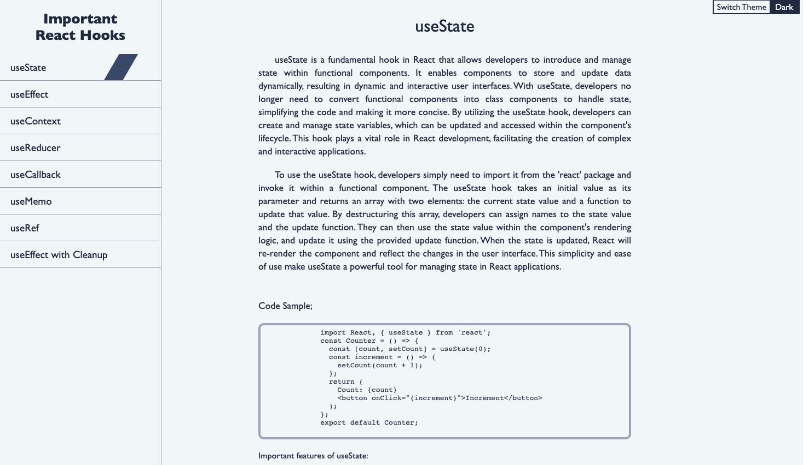
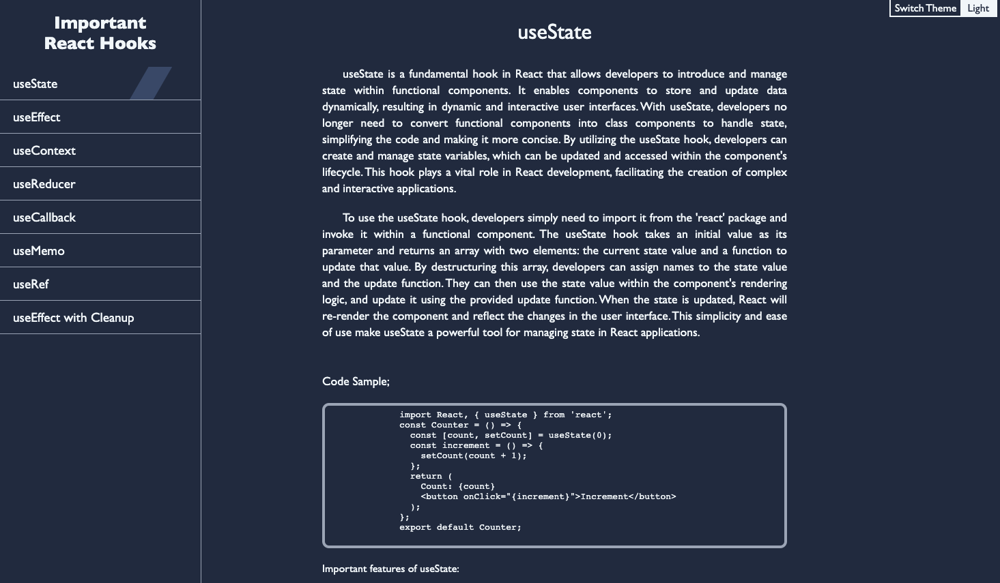

# Technical Documentation Page

## Description
This is a technical documentation page for the React Hooks. It is a part of the Responsive Web Design Projects from FreeCodeCamp. The project is built using HTML and CSS. The page is responsive and can be viewed on any device.

## Technologies Used
* HTML
* CSS

## Live Demo
[Live Site](https://technical.ersinm.com/)

## Screenshot

